# The UNO Scrubber — Professional Timeline Controller

**Mac + Arduino Uno | by roB0Ting MakerWorld**

> **Find this project on MakerWorld:** [Arduino Uno Knob Macro Pad](https://makerworld.com/en/models/2408204-arduino-uno-knob-macro-pad#profileId-2640163)

Turn your dusty Arduino Uno into a professional video editing controller. Most DIY macro pads require you to buy specific "Pro Micro" boards to work as a keyboard. This project is different — it uses the standard Arduino Uno most makers already have! It bridges the Uno to your Mac using a lightweight, zero-latency Python script that auto-detects the device on any USB port.

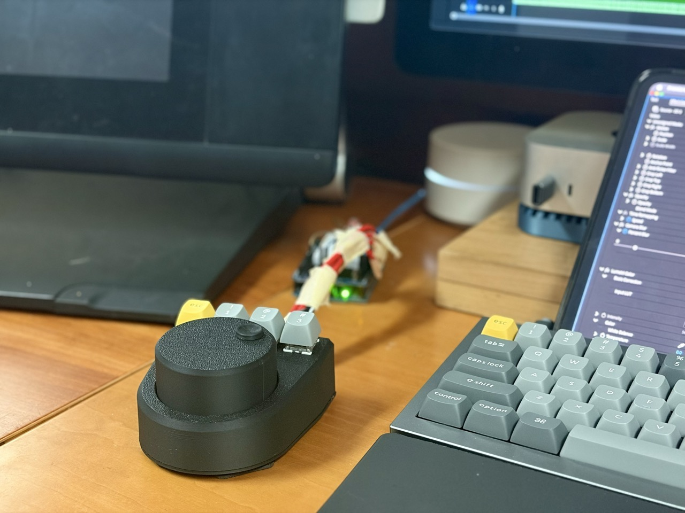

> **Remix Challenge:** This is a fully functional V1, but the current case design requires the Arduino to sit externally (connected by wires reaching out of the box). This project is released under a **CC BY-SA license** — the community is encouraged to remix this enclosure to fit the Uno inside!

---

## Features

- **Mode 1 (LED Off):** Precision Scrubbing — Left/Right Arrow keys
- **Mode 2 (LED Bright):** Fast Scrubbing — Shift + Left/Right
- **4 Custom Macro Keys:** Shift+N, S, Ripple Delete (Option+Del), and Mode Toggle
- **Zero Latency:** Custom buffer-flush logic for instant response
- **Jitter-Free:** Uses a "State Machine" to eliminate rotary encoder bounce

---

## Repository Structure

```
UNO-Scrubber/
├── firmware/
│   └── uno_scrubber/
│       └── uno_scrubber.ino   ← Upload this to your Arduino Uno
├── mac/
│   └── scrubber.py            ← Run this on your Mac
└── images/                    ← Build reference photos
```

---

## Bill of Materials (BOM)

| Item | Part | Notes |
|------|------|-------|
| 1x Arduino Uno (Rev 3) | Elegoo Uno R3 (~$16) | High quality, reliable clone |
| 1x KY-040 Rotary Encoder | DEVMO 2PCS KY-040 | Standard module, comes with most Uno kits |
| 4x Mechanical Switches | Gateron Brown Switches 10pcs (~$2) | Or any Cherry MX style switch |
| 1x LED + Resistor | LED Resistor Kit 600Pcs | Any color LED + a 220Ω resistor |
| Wires | Elegoo 120pcs Multicolored Dupont Wire | See notes below |
| 5x Flat Head Screws | 6-32 Thread, 5/16" Long | Or use Super Glue / Hot Glue for the lid |

**Wire types needed:**
- **Male-to-Male:** Solder one end to the switches, plug the other end into the Arduino
- **Male-to-Female:** Used for the Rotary Encoder (no soldering required on the encoder side)

---

## Step 1 — Print & Assemble the Case

1. **Print:** Main Case, Bottom Plate, and Knob (+ optional knob finger groove)
2. **Insert:** Snap the 4 switches into the Top Plate from the top
3. **Mount:** Slide the Rotary Encoder in from the bottom and glue/screw it on
4. **Optional:** Glue the finger groove onto the top of the knob

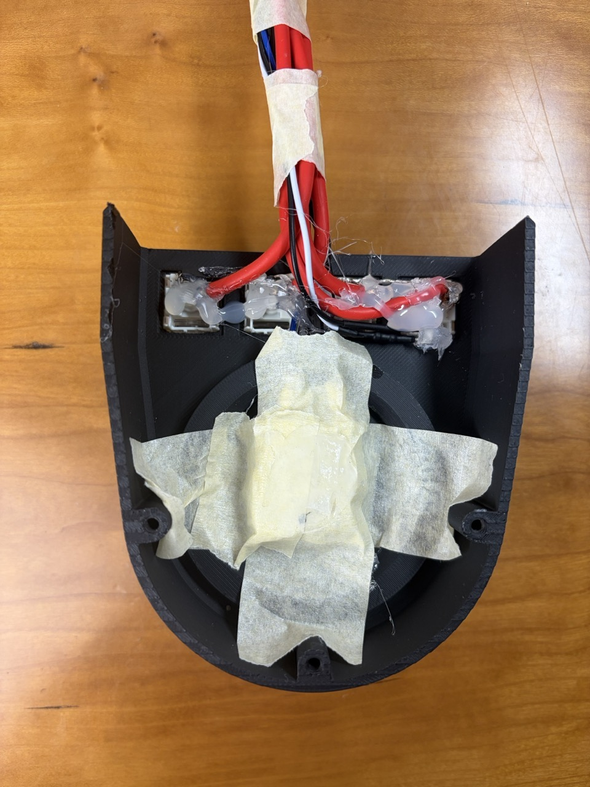

---

## Step 2 — Wiring (The "Common Ground" Method)

Since the Arduino sits outside the case, wires need to be long enough to reach out.

### A. The Switches (Male-to-Male Wires)

For the switches, use spare resistor legs as short jumper wires for soldering:

1. Take spare resistors from your LED kit — snip off one leg per switch
2. Use these legs to make short jumper wires (you're using the metal, not the resistance)
3. Solder the cut end to one pin of each switch, keeping the other pin open for the Arduino

**Ground Chain:** Solder a wire connecting one pin from every switch together. Run a final wire from this chain to a **GND** pin on the Arduino.

**Signal Wires:** Solder a separate male-male wire to the remaining pin of each switch.

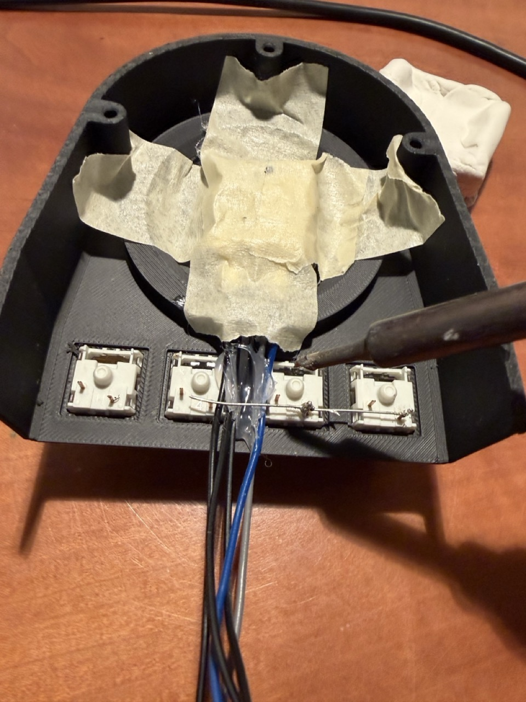

#### Switch Pinout

| Switch Function | Arduino Pin |
|-----------------|-------------|
| Mode Toggle     | Pin 5       |
| Shift + N       | Pin 6       |
| S (Select)      | Pin 7       |
| Option + Delete | Pin 8       |

### B. The Mode Indicator LED

The Mode Toggle key glows when High Speed Mode is active.

- **Preparation:** Solder your 220Ω resistor to the long leg (+) of the LED
- **Mounting:** Apply hot glue to the bottom body of the Mode Toggle switch (Pin 5). Press the LED into the glue so it shines up into the keycap
- **Long Leg (+):** Connect the resistor end to **Pin 9**
- **Short Leg (−):** Connect to **GND**

| LED State | Description |
|-----------|-------------|
| 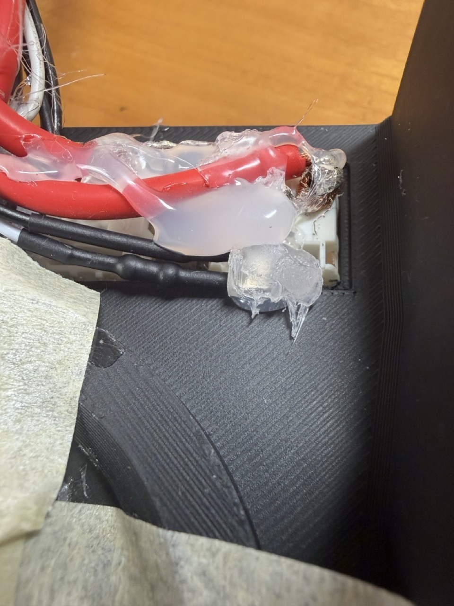 | Mode 1 — Precision Scrub |
| 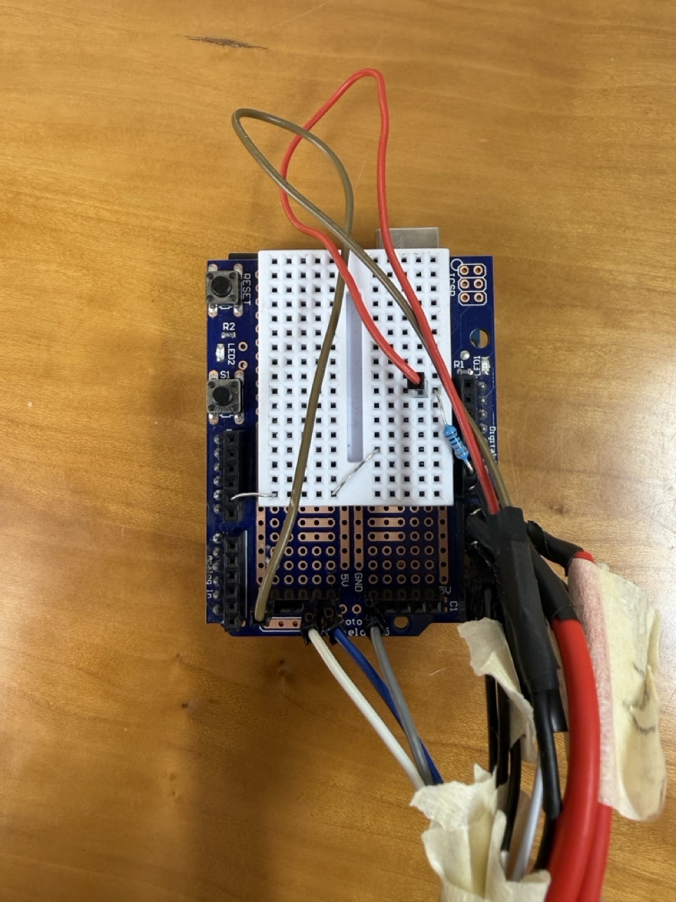 | Mode 2 — Fast Scrub |

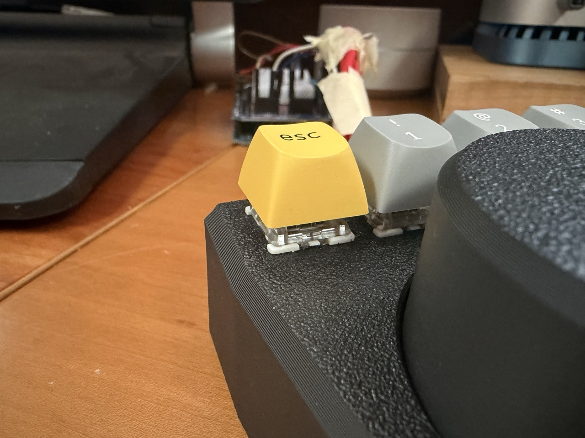

### C. The Rotary Encoder (Male-to-Female Wires)

Use Male-to-Female wires — plug the Female end onto the encoder pins, run the Male end to the Arduino.

| Encoder Pin | Arduino Pin |
|-------------|-------------|
| CLK         | Pin 2       |
| DT          | Pin 3       |
| SW (Button) | Pin 4       |
| + (VCC)     | 5V          |
| GND         | GND         |

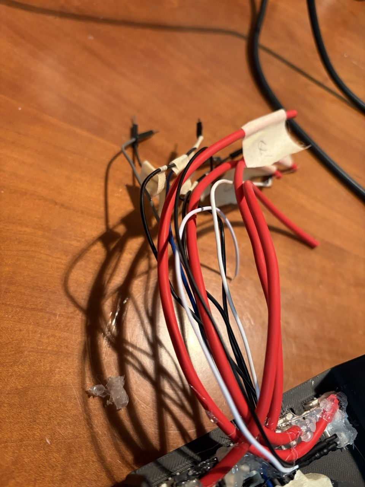

> **Tip:** Label your wires — they can get jumbled quickly!

### D. Close It Up

1. Bundle the wires carefully
2. Screw the bottom lid on (or dab hot glue on the corners)
3. Press the 3D printed knob onto the encoder shaft (tolerances may be tight)

#### Master Wiring Chart

| Component | Pin / Leg | Connection | Wire Type |
|-----------|-----------|------------|-----------|
| Rotary Encoder CLK | — | Pin 2 | Male-to-Female |
| Rotary Encoder DT | — | Pin 3 | Male-to-Female |
| Rotary Encoder SW (Button) | — | Pin 4 | Male-to-Female |
| Rotary Encoder + (VCC) | — | 5V | Male-to-Female |
| Rotary Encoder GND | — | GND | Male-to-Female |
| Switch 1 (Mode) | Signal Pin A | Pin 5 | Male-to-Male |
| Switch 2 (Shift+N) | Signal Pin A | Pin 6 | Male-to-Male |
| Switch 3 (S) | Signal Pin A | Pin 7 | Male-to-Male |
| Switch 4 (Opt+Del) | Signal Pin A | Pin 8 | Male-to-Male |
| All Switches | GND Pin B | GND Daisy-Chain | Male-to-Male |
| LED Long Leg (+) | — | Pin 9 (via 220Ω Resistor) | Soldered |
| LED Short Leg (−) | — | GND | Soldered |

---

## Step 3 — Upload the Arduino Firmware

1. Download and install the [Arduino IDE](https://www.arduino.cc/en/software)
2. Plug in your Uno. Select your port in **Tools > Port**
3. Open `firmware/uno_scrubber/uno_scrubber.ino` in the Arduino IDE
4. Click **Upload** (the arrow icon)

The firmware is in [`firmware/uno_scrubber/uno_scrubber.ino`](firmware/uno_scrubber/uno_scrubber.ino).

---

## Step 4 — Mac Setup

The Arduino Uno is not a native keyboard — a small Python script bridges it to your Mac.

### A. Find Your Username

1. Open **Terminal** (Cmd+Space → type "Terminal")
2. Type `whoami` and press Enter
3. Note the name shown (e.g., `johnsmith`)

### B. Install Required Python Libraries

Paste this into Terminal and press Enter:

```bash
pip3 install pyserial pyautogui --break-system-packages
```

If that fails, try:

```bash
pip3 install pyserial pyautogui
```

> If it asks for a password, type your Mac login password — you won't see the letters, just press Enter.

### C. Save the Script

1. Open **TextEdit**
2. In the menu bar: **Format > Make Plain Text** ⚠️ Do NOT skip this step
3. Paste the contents of [`mac/scrubber.py`](mac/scrubber.py) into the document
4. Save as `scrubber.py` inside your **Documents** folder

> ⚠️ Press **Cmd+I** on the file to confirm the name is exactly `scrubber.py` and **not** `scrubber.py.txt`

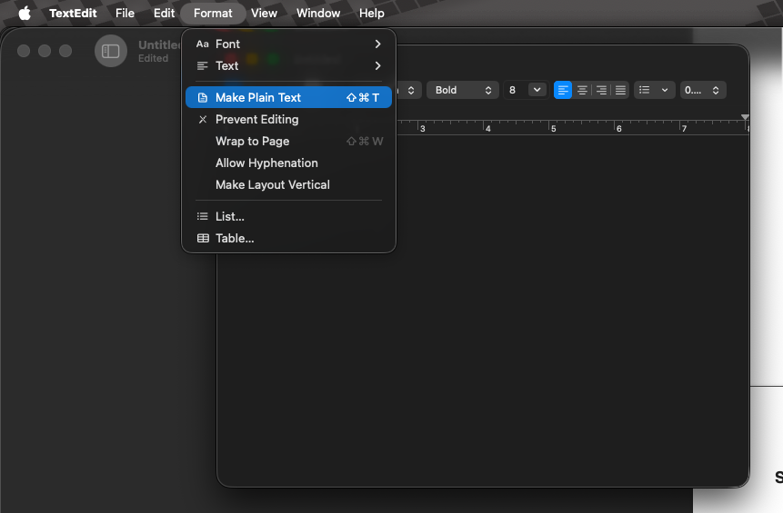

### D. Grant Accessibility Permissions

1. Go to **System Settings > Privacy & Security > Accessibility**
2. Click **+** and add **Terminal**
3. Toggle it **ON**

> ⚠️ If you've already created the Automator app (next step), add the app instead of Terminal.

---

## Step 5 — Auto-Start on Login

Make the scrubber launch automatically when your Mac boots.

1. Open **Automator** (Cmd+Space → type "Automator")
2. Select **Application**
3. Search for **"Run Shell Script"** and drag it to the main window
4. Paste the following command — replace `[YOUR_USERNAME]` with the name from Step 4A:

**Try this first (Standard Python):**
```
/usr/bin/python3 /Users/[YOUR_USERNAME]/Documents/scrubber.py
```

**If the above doesn't work (Homebrew Python):**
```
/opt/homebrew/bin/python3 /Users/[YOUR_USERNAME]/Documents/scrubber.py
```

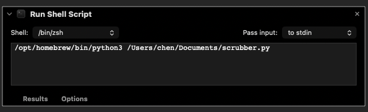
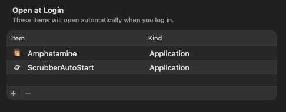

5. Click the **Run (Play)** button to test — if the knob works, you're good!
6. **File > Save** the app as `ScrubberApp` in your **Applications** folder
7. Go to **System Settings > General > Login Items** and add `ScrubberApp`

> ⚠️ Now that you have an Application, update Accessibility permissions (Step 4D) to point to `ScrubberApp` instead of Terminal.

---

## You're Done!

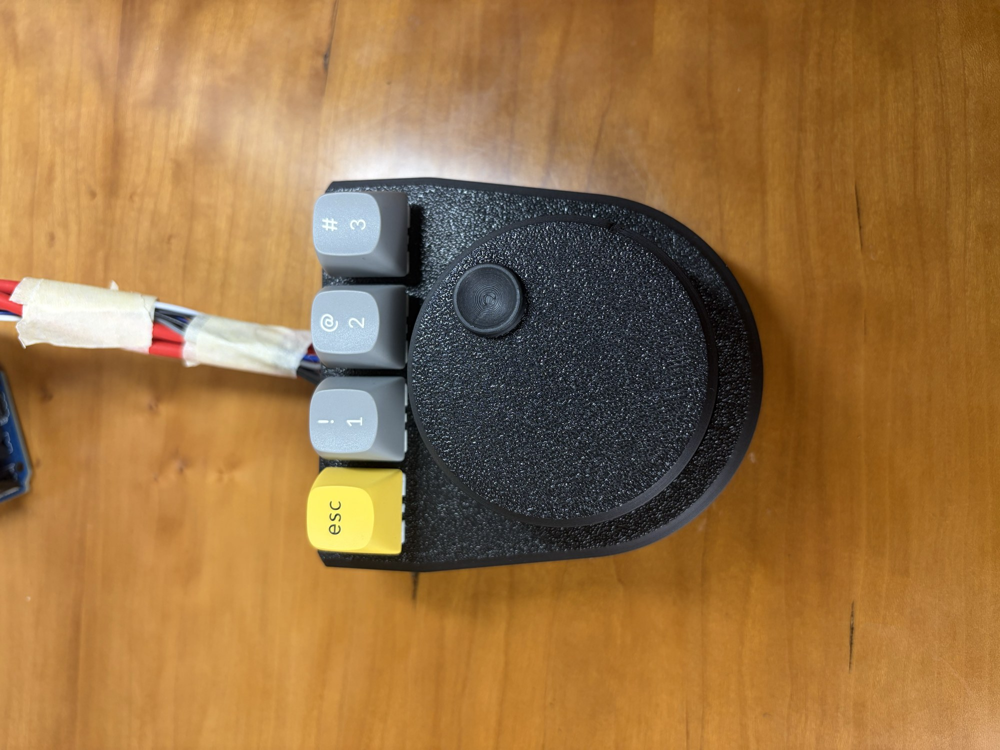

Your Uno Scrubber is now part of your editing desk.

> **Note:** If you unplug the scrubber while your Mac is running, you'll get an error message. Plugging it back in won't auto-reconnect — just reopen the ScrubberApp and wait a few seconds.

---

## License

Released under [CC BY-SA](https://creativecommons.org/licenses/by-sa/4.0/). Build it, remix it, share it!

*This is an experimental V1 project. If you run into issues or have suggestions, open an issue or leave a comment.*
